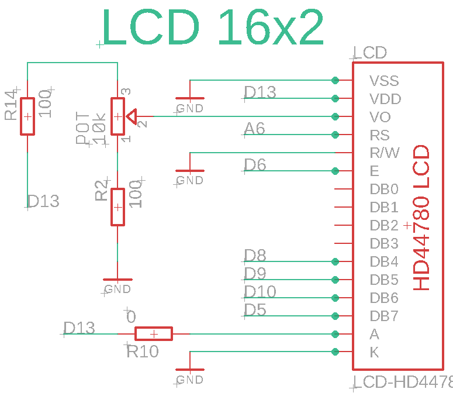
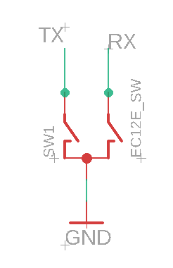
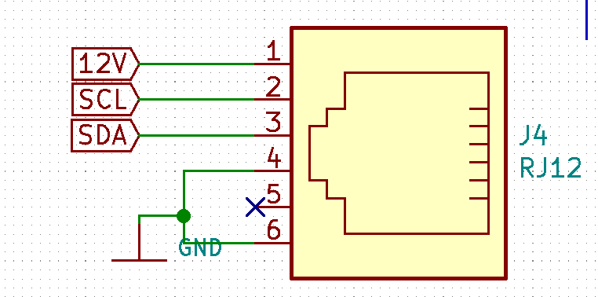
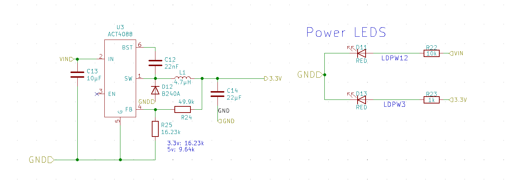
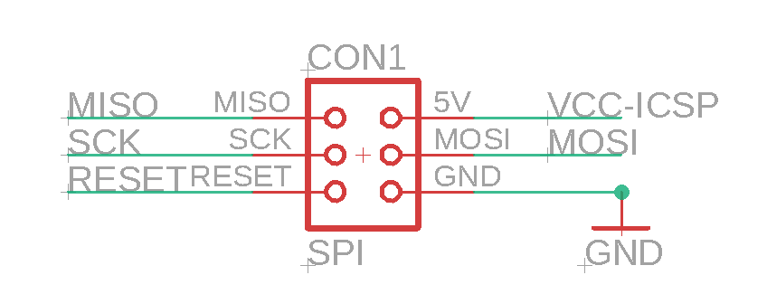
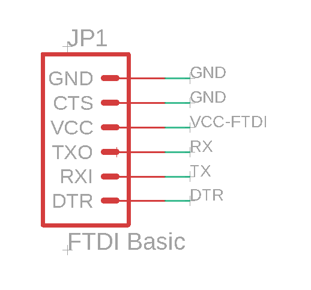
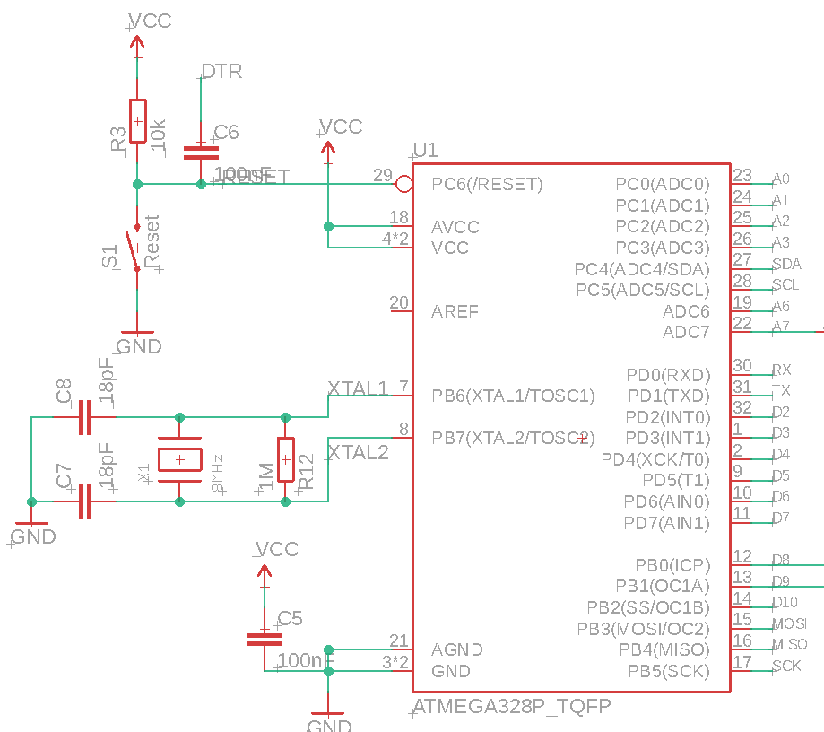

# Simple I2C slave

Slave I2C that can work independently

* LCD screen (2 lines) (7 pins)
* Rotary push button (3 pins)
* RJ-12 connector to connect to a master
* ATMEGA 328
  * we don't need a crystal

## 

[Arduino uno](https://content.arduino.cc/assets/Pinout-UNOrev3_latest.pdf)

| Arduino | Port | Function  | Assigned       |
|---------|------|-----------|----------------|
| 0       |      | RX        | Programming    |
| 1       |      | TX        | Programming    |
| 2       |      | INT0      | rotary 1       |
| 3       |      | INT1 OC2B |                |
| 4       |      |           | rotary 2       |
| 5       |      |           | rotary push    |
| 6       |      | OC0A      | LCD 1          |
| 7       |      |           | LCD 2          |
| 8       |      |           | LCD 3          |
| 9       |      | OC1A      |                |
| 10      |      | SS        |                |
| 11      |      | MOSI      | ICSP           |
| 12      |      | MISO      | ICSP           |
| 13      |      | SCK       | ICSP           |
| A0      |      |           | LCD 4  - Power |
| A1      |      |           | LCD 5          |
| A2      |      |           | LCD 6          |
| A3      |      |           | LCD 7          |
| A4      |      |           |                |
| A5      |      |           |                |
| D18     |      | SDA       | RJ-12 SDA      |
| D19     |      | SCL       | RJ-12 SCL      |

## LCD

## Rotary push button

## RJ-12

6P/6P

* 12v / 24v
* SDA - 3.3v
* SCL - 3.3v
* GND

## Power supply

## Programming

Add the boot loader

[tag-connect](https://www.tag-connect.com/)

Program through USB using FTDI

## Micro-controller

